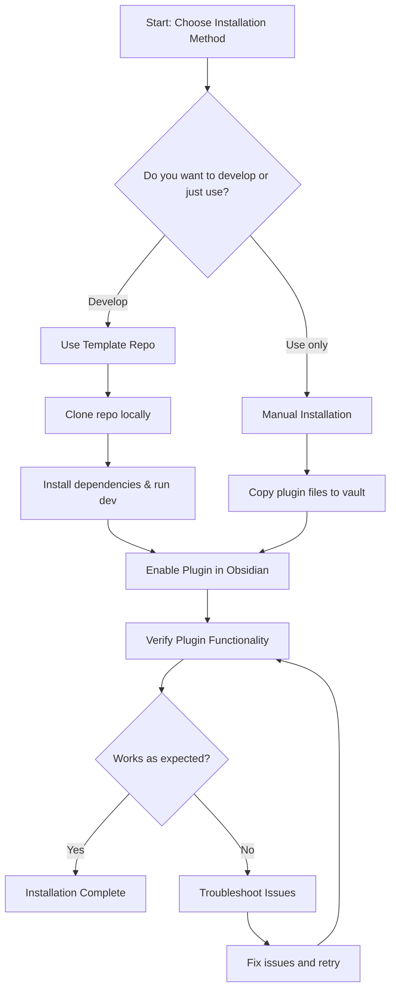

# Installation Methods for the Obsidian Sample Plugin

This guide provides clear, step-by-step instructions to install and set up the Obsidian Sample Plugin using two common methods: development from the template repository and manual installation into your Obsidian vault. Whether you are a plugin developer starting out or a user who wants to add the plugin to your vault, these methods will enable you to get up and running quickly.

---

## 1. Installing via the Sample Plugin Template (Development Approach)

This is the recommended approach if you want to customize, extend, or develop the Sample Plugin.

### Step 1: Create Your Plugin Repository from the Template
- Go to the GitHub repository for the Obsidian Sample Plugin: [https://github.com/obsidianmd/obsidian-sample-plugin](https://github.com/obsidianmd/obsidian-sample-plugin)
- Click the "Use this template" button to create your own plugin repository based on this template.

### Step 2: Clone Your Repository Locally
- Clone your newly-created repo to your local machine using Git:
  ```bash
  git clone https://github.com/your-username/your-plugin-repo.git
  ```
- It is recommended to place your plugin folder inside your vault directory under:
  ```plaintext
  YourVault/.obsidian/plugins/your-plugin-id/
  ```

### Step 3: Install Dependencies
- Ensure NodeJS v16 or higher is installed on your system. Verify with:
  ```bash
  node --version
  ```
- Navigate into your plugin folder in the command line and install required packages:
  ```bash
  npm install
  ```

### Step 4: Build and Watch for Changes
- Start plugin compilation in watch mode to auto-compile on code changes:
  ```bash
  npm run dev
  ```

### Step 5: Load the Plugin in Obsidian
- Open Obsidian and go to **Settings > Community Plugins > Disabled Plugins**.
- Enable your plugin by toggling it on.
- If this is a new plugin, use **Reload Plugins** after compiling changes.

<Tip>
If you update the Obsidian API version or dependencies, you can run:
```npm update```
inside your plugin folder to keep things up to date.
</Tip>

---

## 2. Manual Installation into Your Obsidian Vault

Use this method if you want to install the Sample Plugin for immediate use without development.

### Step 1: Download or Build the Plugin Files
- Download the compiled plugin files (`main.js`, `manifest.json`, and optionally `styles.css`) from the latest release or build them yourself using the development approach above.

### Step 2: Copy Files to Vault
- Copy these files into your vault folder under:
  ```plaintext
  YourVault/.obsidian/plugins/sample-plugin/
  ```
- Ensure the folder name matches your plugin's `id` field, which is `sample-plugin` in this plugin’s `manifest.json`.

### Step 3: Enable the Plugin
- Open Obsidian.
- Navigate to **Settings > Community Plugins**.
- Find **Sample Plugin** in the list and toggle it on.

<Check>
If the plugin does not appear in the list, verify that the files are placed under the correct folder and that `manifest.json` includes the proper `id` and `minAppVersion`.
</Check>

---

## Verification

After installation using either method, verify success by:

- Confirming the ribbon icon (a dice) appears on the left sidebar.
- Clicking the ribbon icon shows a notice "This is a notice!".
- Opening the command palette (`Ctrl+P` or `Cmd+P`) and searching for "Open sample modal (simple)" opens a modal with the text "Woah!".

These interactions confirm the plugin is installed and functioning as expected.

---

## Troubleshooting

<AccordionGroup title="Common Installation Issues and Solutions">
<Accordion title="Plugin Doesn't Appear in Community Plugins List">
- Verify the plugin files are correctly placed in the vault under `.obsidian/plugins/sample-plugin/`.
- Check `manifest.json` for correct `id` (`sample-plugin`) and `minAppVersion` (should be at least `0.15.0`).
- Reload Obsidian or restart the app after placing files.
- Ensure your Obsidian app version meets the minimum requirement.
</Accordion>
<Accordion title="Compilation Errors During Development">
- Confirm NodeJS version is 16 or greater using `node --version`.
- Run `npm install` before `npm run dev`.
- Check terminal output for specific errors and look for missing dependencies.
</Accordion>
<Accordion title="Ribbon Icon or Commands Not Responding">
- Make sure you have enabled the plugin in Community Plugins settings.
- Review the developer console in Obsidian (toggle with `Ctrl+Shift+I` or `Cmd+Alt+I`) for errors.
- Check that the code compilation succeeded without errors.
</Accordion>
</AccordionGroup>

---

## Additional Notes

- The plugin requires Obsidian version 0.15.0 or newer. Check your app version under **Settings > About**.
- Development workflows and customization should be done following the guidance in the **Developer Setup** and **Customizing the Sample Plugin** guides.
- For full development instruction, see the [README.md](https://github.com/obsidianmd/obsidian-sample-plugin/blob/main/README.md) in the sample plugin repository.

---

### Summary Diagram of Installation Workflow



This flow reflects the paths to get the plugin installed and verified.

---

## References and Next Steps

- [Prerequisites & System Requirements](../setup-installation/prerequisites.md)
- [Developer Setup Guide](../setup-installation/developer-setup.md)
- [Enabling the Plugin in Obsidian](../../first-run-validation/enable-plugin.md)
- [First Usage & Expected Behaviors](../../first-run-validation/initial-usage.md)
- [Troubleshooting Common Setup Issues](../../first-run-validation/troubleshooting.md)
- [Sample Plugin GitHub Repository](https://github.com/obsidianmd/obsidian-sample-plugin)
- [Obsidian Plugin API Documentation](https://github.com/obsidianmd/obsidian-api)


---

By following the steps above, you can quickly get started with the Obsidian Sample Plugin, whether you want to develop new features or simply add the plugin to your vault for immediate use. This foundational installation knowledge supports a smooth onboarding experience.
