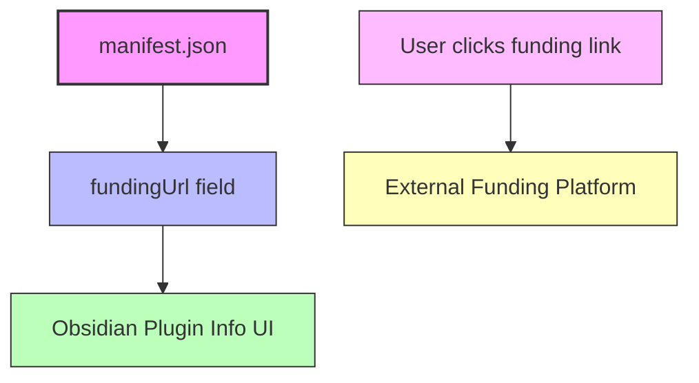

# Adding and Promoting Plugin Funding Links

Enabling sponsorship and funding links in your Obsidian plugin is a strategic way to invite community support while maintaining transparency and user trust. This guide walks you through the practical steps to configure funding URLs in your plugin manifest, support multiple platforms, and ethically engage your users for financial backing.

---

## 1. Purpose and Benefits of Plugin Funding Links

Supporting your plugin financially allows you to dedicate more time to development, improve functionality, and foster a sustainable ecosystem. By adding funding URLs, you give users an easy and visible way to contribute, encouraging good will without intrusive prompts.

### What You'll Accomplish
- Configure funding URLs in your plugin's manifest file
- Support single or multiple funding platforms
- Present your funding options transparently to users
- Apply ethical guidelines for soliciting support

### Prerequisites
- Basic knowledge of your plugin's `manifest.json`
- Access to update your plugin's repository and manifest file

### Expected Outcome
Your plugin will display actionable funding links that users can follow to support your work, improving your engagement and sustainability.

---

## 2. Configuring Funding URLs in manifest.json

The primary way to enable funding links is by setting the `fundingUrl` field in your plugin’s `manifest.json` file. Obsidian recognizes this field and will include funding options appropriately.

### a. Single Funding URL

If you only have one platform for receiving support, add a simple string URL:

```json
{
    "fundingUrl": "https://buymeacoffee.com/yourname"
}
```

### b. Multiple Funding Platforms

If you want to list several options, provide a JSON object with platform names as keys and URLs as values:

```json
{
    "fundingUrl": {
        "Buy Me a Coffee": "https://buymeacoffee.com/yourname",
        "GitHub Sponsor": "https://github.com/sponsors/yourname",
        "Patreon": "https://www.patreon.com/yourname"
    }
}
```

### Best Practices
- Use official or well-known platforms to build credibility
- Ensure URLs are accurate and active
- Include platform names that clearly describe the link destination

### Updating
After adding or updating the `fundingUrl` field:
1. Commit and push changes to your repository
2. Publish a new release if applicable
3. Update your plugin in Obsidian to reflect changes

---

## 3. Ethical Tips for Soliciting Support

Inviting users to support your plugin should be done thoughtfully to maintain goodwill:

- **Be Transparent:** Clearly state how funds will support development or improvements.
- **Avoid Intrusiveness:** Use subtle indicators rather than aggressive prompts.
- **Respect Privacy:** Don’t collect personal data beyond what fundraising platforms require.
- **Express Gratitude:** Thank contributors publicly or through plugin messages.

<Tip>
Being upfront about your funding goals builds trust and encourages voluntary support without pressuring users.
</Tip>

---

## 4. Practical Example of manifest.json with Funding URLs

```json
{
    "id": "sample-plugin",
    "name": "Sample Plugin",
    "version": "1.0.0",
    "minAppVersion": "0.15.0",
    "description": "Demonstrates some of the capabilities of the Obsidian API.",
    "author": "Your Name",
    "authorUrl": "https://yourwebsite.com",
    "fundingUrl": {
        "Buy Me a Coffee": "https://buymeacoffee.com/yourname",
        "GitHub Sponsor": "https://github.com/sponsors/yourname"
    },
    "isDesktopOnly": false
}
```

Once updated, users visiting your plugin info in Obsidian will see these funding options clearly.

---

## 5. Verification and Troubleshooting

### How to Verify
- Open Obsidian and go to Settings > Community Plugins > Your Plugin
- Locate the funding links section, which should display your URLs
- Click links to ensure they redirect correctly

### Common Issues

<AccordionGroup title="Troubleshooting Funding URLs">
<Accordion title="Funding links do not appear">
- Check that your `manifest.json` is valid JSON and includes the `fundingUrl` field.
- Ensure you have reloaded or updated your plugin in Obsidian.
- Verify you are running a compatible Obsidian app version that supports funding URLs.
</Accordion>
<Accordion title="Links are incorrect or broken">
- Confirm all URLs are correctly typed with the proper protocol (`https://`).
- Make sure the platforms you link to are active and your profile exists.
- Update the manifest and redeploy the plugin if changes are made.
</Accordion>
</AccordionGroup>

---

## 6. Summary Diagram: How Funding Integration Fits in Plugin Lifecycle



---

## 7. Next Steps & Related Documentation

- **Publishing Your Plugin:** Learn how to release updates effectively after modifying funding links ([Publishing Your Plugin to the Community](https://obsidian.md/obsidian-sample-plugin-guides/release-publish-best-practices/publishing-to-community))
- **Plugin Manifest Reference:** Understand all fields and metadata options in the plugin manifest ([manifest.json documentation](https://obsidian.md/obsidian-sample-plugin-guides/overview/features-architecture/integration-points))
- **Setting Up Development:** Prepare your environment to quickly iterate on your plugin and test funding link changes ([Setup Development Environment](https://obsidian.md/obsidian-sample-plugin-guides/getting-started-workflows/setup-development-environment))

Implement funding URLs conscientiously to engage your users in supporting your plugin’s growth while maintaining a professional and trustworthy presence.

---

<Check>
Make sure to validate your manifest file for JSON syntax errors each time you add or modify funding URLs to avoid plugin loading failures.
</Check>

<Note>
Obsidian currently supports displaying funding URLs via the manifest. Future plugin versions may include enhanced UI options for promoting sponsorships—stay updated with official documentation.
</Note>

---