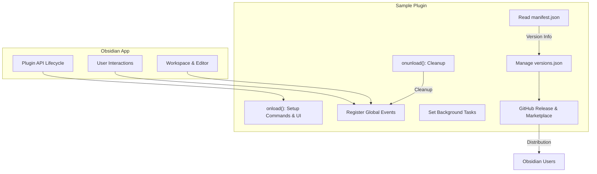

# Integration with Obsidian & Other Systems

## Unlocking Seamless Plugin Interoperation Within Obsidian

The `Integration with Obsidian & Other Systems` page guides you through how the Obsidian Sample Plugin hooks gracefully into Obsidian's core plugin API. It explains how the plugin listens and reacts to key application events, prepares itself for the wider plugin ecosystem, and sets the stage for smooth publishing in the community marketplace and future upgrade workflows.

Whether you are preparing your plugin for public distribution or simply aiming to understand how your plugin interacts with Obsidian's environment beyond its own internal logic, this page demystifies those integration points.

---

## What This Page Covers

- How the sample plugin connects directly to Obsidian’s plugin API lifecycle
- Responding to app-level events to maintain smooth functionality
- Considerations for interoperation with the community plugin marketplace
- Steps to prepare your plugin for publishing and managing API dependency upgrades

---

## Why Integration Matters

Building a plugin is more than crafting internal features — it’s about harmonizing your code with Obsidian’s ecosystem. This page teaches you the essential touchpoints where your plugin must engage with Obsidian’s API and external workflows, enabling your plugin to:

- React meaningfully to user actions and app state changes
- Safeguard compatibility across Obsidian versions
- Prepare for community discovery by publishing through approved channels
- Manage versioning and dependencies with minimal friction

By mastering these integration aspects, you make sure your plugin not only works but thrives alongside other plugins and Obsidian updates.

---

## Connecting to the Obsidian Plugin API

The sample plugin connects to Obsidian primarily through lifecycle methods and API hooks exposed by the base `Plugin` class. Key steps include:

- **`onload()`**: Called automatically when Obsidian activates your plugin. Here, the plugin performs initialization logic such as setting up commands, UI elements, event listeners, and background tasks.
- **`onunload()`**: Invoked when the plugin is disabled or unloaded to clean up resources and unregister handlers.

The plugin registers commands, ribbon icons, status bar elements, and event listeners within `onload()` to respond interactively to users and app state.

<CodeGroup>
```typescript
async onload() {
  await this.loadSettings();
  this.addRibbonIcon('dice', 'Sample Plugin', () => new Notice('This is a notice!'));
  this.addCommand({ id: 'open-sample-modal-simple', name: 'Open sample modal (simple)', callback: () => new SampleModal(this.app).open() });
  this.registerDomEvent(document, 'click', (evt) => console.log('click', evt));
  this.registerInterval(window.setInterval(() => console.log('setInterval'), 300000));
}
```
</CodeGroup>

> Using these API hooks ensures your plugin engages fully with the Obsidian app lifecycle, maintaining performance and user experience.

---

## Responding to Application-Level Events

Plugins often need to react to global state, such as workspace changes, file events, or user interactions outside the plugin's scope. The sample plugin demonstrates this by:

- Registering DOM event listeners that automatically unregister on unload
- Creating interval-based background tasks that clean up cleanly

This approach prevents resource leaks and avoids interfering with the core app or other plugins.

<Accordion title="Example: Registering a DOM Event">
Inside the `onload()` method, the plugin calls:

```typescript
this.registerDomEvent(document, 'click', (evt: MouseEvent) => {
  console.log('click event detected', evt);
});
```

This attaches a click event listener to the document which logs every click. When the plugin unloads, Obsidian automatically removes this listener for you.

This safe event registration is critical for maintaining app stability and plugin isolation.

</Accordion>

---

## Preparing for Community Publishing and Marketplace Integration

Publishing your plugin to the Obsidian community marketplace requires more than functional code:

- **Manifest Setup**: Your `manifest.json` declares crucial metadata including plugin id, name, version, description, author, minimum Obsidian version, and funding URLs.
- **Version Management**: The `versions.json` file maps plugin versions to the minimum compatible Obsidian app versions, enabling the marketplace to serve the correct code versions to different users.

Updating and managing these files carefully ensures that your users experience smooth upgrades and avoid compatibility errors.

<AccordionGroup title="Key Steps for Marketplace Preparation">
<Accordion title="1. Update Your Manifest">
Edit `manifest.json` to set `version` and `minAppVersion` for every release.

Example snippet:

```json
{
  "version": "1.0.0",
  "minAppVersion": "0.15.0"
}
```
</Accordion>
<Accordion title="2. Update Versions Mapping">
Edit or generate `versions.json` to reflect your new release line:

```json
{
  "1.0.0": "0.15.0"
}
```
</Accordion>
<Accordion title="3. Create a GitHub Release">
Tag and publish a GitHub release matching your version number, attaching these files:
- `manifest.json`
- `main.js` (your bundled plugin code)
- `styles.css` (optional styling)

This release becomes the source for the marketplace to distribute.
</Accordion>
</AccordionGroup>

---

## Managing API Dependency Upgrades

Obsidian’s plugin API evolves continuously, so keeping your development environment and dependencies updated is vital:

- Run `npm update` regularly to fetch the latest API TypeScript definitions.
- Manually bump version and compatibility values in `manifest.json` to signal support for newer app versions.
- Use automation scripts for version bumps like `npm version patch` that streamline updates across `manifest.json` and `versions.json`.

---

## Real-World Scenario: Publishing Your First Community Plugin

Imagine you finished developing a plugin and want to share it with the world. This page helps you follow a clear journey:

1. Connect your plugin lifecycle events and register commands to ensure smooth user experience.
2. React responsibly to global events with proper registration and cleanup.
3. Update your `manifest.json` and `versions.json` to match your release details.
4. Create a GitHub release with the exact version and required files attached.
5. Submit a pull request to the Obsidian releases repository to add your plugin to the community list.

Completing these integration steps transforms your plugin from a personal project into a trusted, discoverable tool in the Obsidian ecosystem.

---

## Troubleshooting Common Integration Issues

<Accordion title="Plugin Does Not Appear in Community List">
- Verify your GitHub release tag matches your manifest version exactly.
- Ensure `manifest.json` is present both at the repo root and inside the release assets.
- Confirm your pull request to the community repo was merged.
</Accordion>

<Accordion title="Plugin Fails to Load After Update">
- Check `minAppVersion` compatibility in `manifest.json` aligns with your users’ Obsidian versions.
- Verify API typings are up to date via `npm update`.
- Look for errors in the developer console related to missing or outdated dependencies.
</Accordion>

<Accordion title="Event Listeners Not Cleaning Up">
- Use Obsidian's `registerDomEvent` and `registerInterval` to ensure listeners/intervals get cleaned up on unload.
- Avoid manually attaching events without unregistering them in `onunload()`.
</Accordion>

---

## Next Steps

Ready to implement integration points? See the following related documentation:

- [What is the Obsidian Sample Plugin?](../getting-started-intro/what-is-plugin) — Understand core plugin concepts.
- [Quick Feature Overview](../features-architecture/quick-features-summary) — Learn about the plugin's key features integrating with the app.
- [Releasing New Plugin Versions](../../guides/release-publish-best-practices/releasing-new-versions) — Deep dive into best practices for versioning and publishing.
- [Publishing Your Plugin to the Community](../../guides/release-publish-best-practices/publishing-to-community) — Step-by-step to get your plugin listed.

Explore these sections to master your plugin’s full lifecycle from development to distribution.

---

## References

- Official Obsidian Plugin API: https://github.com/obsidianmd/obsidian-api
- Sample Plugin GitHub Repository: https://github.com/obsidianmd/obsidian-sample-plugin
- Plugin Guidelines: https://docs.obsidian.md/Plugins/Releasing/Plugin+guidelines


---

**Visual Summary of Integration Flow:**



This diagram illustrates how your plugin engages at runtime through API lifecycle hooks, reacts to user and workspace events, and prepares releases that integrate into the Obsidian marketplace for smooth community adoption.

---

### See also:
- [Core Concepts and Terminology](../getting-started-intro/core-concepts-terminology)
- [Architecture Diagram](../features-architecture/plugin-architecture-diagram)
- [Releasing New Plugin Versions](../../guides/release-publish-best-practices/releasing-new-versions)
- [Publishing Your Plugin to the Community](../../guides/release-publish-best-practices/publishing-to-community)