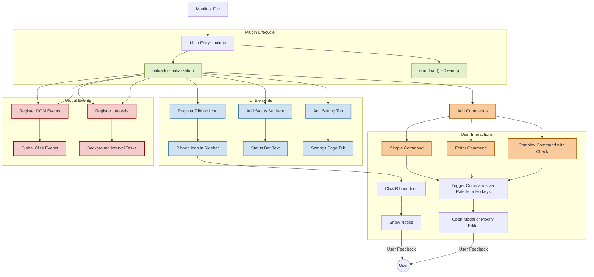

# Architecture Diagram

Explore the visual blueprint of the Sample Plugin's core components and their interactions within Obsidian. This diagram maps how the main entry point, manifest, and plugin lifecycle tie together to create a seamless user experience. Understanding this flow empowers you to customize and extend the plugin confidently, seeing exactly how commands, UI elements, and events register and interact.

---

## Why This Diagram Matters

Developing an Obsidian plugin involves orchestrating multiple moving parts—from commands triggered by the user to UI elements displayed and lifecycle events governing plugin behavior. Without a clear mental model, this can feel overwhelming.

This architecture diagram breaks down the complexity by visually representing:

- How the plugin initializes and loads using the main entry script
- How the manifest sets up the plugin's identity and capabilities
- The lifecycle phases and event hooks that enable dynamic interaction
- The journey of commands and UI events as they get registered and processed

With this framework, you’ll gain clarity on the plugin internals, making troubleshooting, customization, and feature extension intuitive.

---

## Core Components Visualized

---

## How to Use This Diagram

- **Get Oriented Quickly:** If you are new to Obsidian plugin development, start here to understand the high-level flow before diving into code details.
- **Customization Roadmap:** Follow the flow from the `onload` lifecycle method to find where and how you can add or modify plugin behavior.
- **Debugging Aid:** Visualize what happens when a command is triggered or a UI element is interacted with, helping isolate issues.
- **Extend Confidently:** Use this mental model to plan new features by mapping them onto the existing lifecycle and UI structure.

---

## Key Insights from the Diagram

- **Manifest file** acts as the declarative root, defining plugin identity and compatibility.
- **Main entry (`main.ts`)** drives lifecycle methods that bootstrap the various plugin parts.
- **Lifecycle hooks (`onload` and `onunload`)** are your primary extension points to register UI components, commands, settings pages, and global events.
- **Commands come in multiple forms:** simple, editor-specific, and conditional, giving flexibility in how they integrate with Obsidian.
- **UI components like ribbon icons and status bar items provide interactive elements for users, triggered by registered commands or direct events.**
- **Global events and intervals enable background tasks and app-wide interactions, all cleaned up automatically during unload.**

---

## Practical Tip

When crafting your own plugin or extending the Sample Plugin:

- Focus first on the `onload` method for setting up your components as the diagram shows.
- Use this diagram to verify you’ve hooked into all expected points.
- Remember to clean up properly in `onunload`.

This visualization is your compass for navigating the plugin’s architecture.

---

## Related Documentation

- See [Quick Feature Overview](/overview/features-architecture/quick-features-summary) for detailed explanation of features referenced here.
- For core concepts like ribbon icons and commands, refer to [Core Concepts and Terminology](/overview/getting-started-intro/core-concepts-terminology).
- To understand plugin setup and lifecycle in depth, review [What is the Obsidian Sample Plugin?](/overview/getting-started-intro/what-is-plugin).

---

Harness the power of this architecture diagram as your essential guide to mastering and customizing the Obsidian Sample Plugin.
