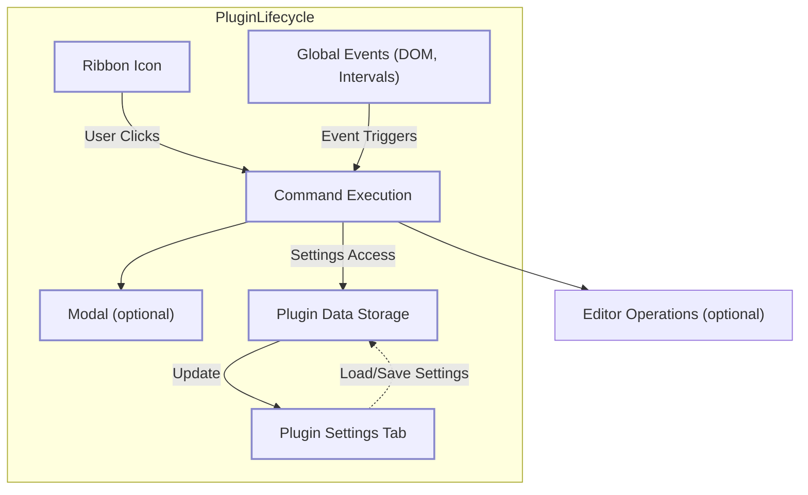

# Core Concepts and Terminology

Welcome to the foundational guide that unlocks the essential building blocks you’ll encounter repeatedly when developing plugins for Obsidian. This page demystifies critical terms such as ribbon icons, commands, modals, plugin settings tabs, and global events within the plugin framework. Whether you’re just starting or need a quick refresher, understanding these core components will accelerate your ability to create powerful and user-friendly plugins.

---

## Understanding the Core Components

### Ribbon Icons: Your Plugin's Front Door

A ribbon icon is a clickable icon appearing on Obsidian's left sidebar. It acts as the primary user entry point to your plugin's features. Adding a ribbon icon:

- Provides instant visibility and easy access.
- Encourages user interaction with immediate feedback.

**Example:** In the sample plugin, a dice icon adorned with a custom CSS class appears on the ribbon. Clicking it triggers a notice as confirmation of action.

```typescript
const ribbonIconEl = this.addRibbonIcon('dice', 'Sample Plugin', (evt: MouseEvent) => {
    new Notice('This is a notice!');
});
ribbonIconEl.addClass('my-plugin-ribbon-class');
```

### Commands: Trigger Actions Anywhere

Commands enable users to invoke plugin actions from Obsidian's command palette or keyboard shortcuts. They are flexible and come in three varieties:

- **Simple Commands:** Run a callback function directly.
- **Editor Commands:** Operate on the active editor, modifying or reading its content.
- **Complex Commands with Conditions:** Include a `checkCallback` to control availability based on the current app state.

**Use case:** Open a modal dialog or modify editor text only if a Markdown view is active.

```typescript
this.addCommand({
    id: 'open-sample-modal-simple',
    name: 'Open sample modal (simple)',
    callback: () => {
        new SampleModal(this.app).open();
    }
});

this.addCommand({
    id: 'sample-editor-command',
    name: 'Sample editor command',
    editorCallback: (editor, view) => {
        editor.replaceSelection('Sample Editor Command');
    }
});

this.addCommand({
    id: 'open-sample-modal-complex',
    name: 'Open sample modal (complex)',
    checkCallback: (checking) => {
        const markdownView = this.app.workspace.getActiveViewOfType(MarkdownView);
        if (markdownView) {
            if (!checking) {
                new SampleModal(this.app).open();
            }
            return true;
        }
    }
});
```

### Modals: Interactive Dialogs for User Engagement

Modals are overlay windows used to focus user attention on critical tasks or information. Your plugin can create custom modal dialogs by extending the `Modal` class.

- Use modals to gather input, show confirmations, or display important content.
- Modals handle opening and closing lifecycle events, where you can manipulate DOM elements.

**Example:** The sample plugin’s modal displays the text 'Woah!' when opened.

```typescript
class SampleModal extends Modal {
    constructor(app: App) {
        super(app);
    }
    onOpen() {
        this.contentEl.setText('Woah!');
    }
    onClose() {
        this.contentEl.empty();
    }
}
```

### Plugin Setting Tabs: Empowering User Customization

Settings tabs appear in Obsidian’s settings pane, enabling users to configure your plugin’s behavior.

- Extend `PluginSettingTab` to create your settings UI.
- Use `Setting` components to create inputs like text fields, toggles, and dropdowns.
- Persist settings with `loadData` and `saveData` methods to maintain user preferences across sessions.

**Example:** A secret setting which updates when the user types and saves automatically.

```typescript
class SampleSettingTab extends PluginSettingTab {
    plugin: MyPlugin;
    constructor(app: App, plugin: MyPlugin) {
        super(app, plugin);
        this.plugin = plugin;
    }
    display(): void {
        const {containerEl} = this;
        containerEl.empty();
        new Setting(containerEl)
            .setName('Setting #1')
            .setDesc('It\'s a secret')
            .addText(text => text
                .setPlaceholder('Enter your secret')
                .setValue(this.plugin.settings.mySetting)
                .onChange(async (value) => {
                    this.plugin.settings.mySetting = value;
                    await this.plugin.saveSettings();
                }));
    }
}
```

### Global Events: Reacting to the Bigger Picture

Your plugin can listen for global DOM events and intervals outside its own UI components, such as clicks anywhere in the app or periodic timers.

- Use `registerDomEvent` to listen for events like clicks, ensuring automatic cleanup when the plugin unloads.
- Use `registerInterval` for periodic tasks with guaranteed cleanup.

**Example:** Logging every click anywhere in the app and an interval logging every 5 minutes.

```typescript
this.registerDomEvent(document, 'click', (evt: MouseEvent) => {
    console.log('click', evt);
});

this.registerInterval(window.setInterval(() => console.log('setInterval'), 5 * 60 * 1000));
```

---

## How These Concepts Work Together

When building your plugin, these components form the core workflow:

1. **Add a ribbon icon** to provide instant access to users.
2. **Define commands** that users can invoke directly or via the editor.
3. **Utilize modals** for focused interactions.
4. **Create settings tabs** for customization and persist user preferences.
5. **Listen for global events** to react dynamically to app-wide changes.

This foundation scaffolds the user experience and functionality, ensuring your plugin feels integrated, responsive, and configurable.

---

## Tips for Success

- Assign meaningful names to commands and settings so users understand their purpose.
- Use the ribbon icon to highlight your plugin’s key feature. Avoid cluttering the ribbon with unnecessary icons.
- Use `checkCallback` smartly to prevent commands from running in inappropriate contexts, improving usability.
- Clean up global events and timers properly with Obsidian’s registration methods to avoid memory leaks.
- Test modals thoroughly on open and close events to prevent UI glitches.

---

## Troubleshooting Common Issues

<AccordionGroup title="Common Challenges and Solutions">
<Accordion title="Ribbon Icon Not Showing Up">
Ensure your plugin’s `onload` method calls `addRibbonIcon`. If your custom CSS class hides or distorts the icon, try removing or adjusting it. Reload Obsidian after enabling the plugin.
</Accordion>
<Accordion title="Commands Not Executing">
Verify that command IDs are unique and correctly registered during `onload`. For commands with `checkCallback`, confirm conditions return `true` when you expect the command to be enabled.
</Accordion>
<Accordion title="Modal Does Not Appear">
Confirm you call the `open()` method on the modal instance. Check console logs for errors during `onOpen`. Also, ensure no CSS conflicts block visibility.
</Accordion>
<Accordion title="Settings Not Saving or Loading">
Ensure you use `await this.loadData()` and `await this.saveData()` correctly in your plugin's async methods. Data persistence depends on these calls functioning properly.
</Accordion>
<Accordion title="Global Event Listeners Leak or Duplicate">
Always register global events and intervals with Obsidian’s `registerDomEvent` and `registerInterval` inside `onload`. This guarantees automatic cleanup when the plugin disables.
</Accordion>
</AccordionGroup>

---

## Next Steps

Now that you understand these core concepts, use this knowledge to explore practical examples and workflows on how these elements combine in a working plugin. See the [Sample Plugin main.ts code](https://github.com/obsidianmd/obsidian-sample-plugin/blob/main/main.ts) for concrete implementations.

You’re ready to dive deeper into customizing commands, extending modals, or enriching settings with advanced controls. For guidance, visit the [Getting Started Guides](/overview/getting-started-intro) to build your developer skills step-by-step.

---

## Summary Diagram: Core Plugin Components and Interactions



This diagram illustrates how your plugin's primary components relate and interact: user actions via ribbon icons or commands may open modals or manipulate the editor, settings allow customizations stored persistently, and global events provide app-wide responsiveness—all under the plugin’s lifecycle management.

---

## References

- [Obsidian API Documentation](https://github.com/obsidianmd/obsidian-api)
- Sample plugin source code: [main.ts on GitHub](https://github.com/obsidianmd/obsidian-sample-plugin/blob/main/main.ts)
- Related pages:
  - [What is the Obsidian Sample Plugin?](/overview/getting-started-intro/what-is-plugin)
  - [Target Audience and Use Cases](/overview/getting-started-intro/audience-usecases)

---

This foundational understanding sets you on the path to creating your own compelling and well-integrated Obsidian plugins, building user trust and enhancing the editing experience.
