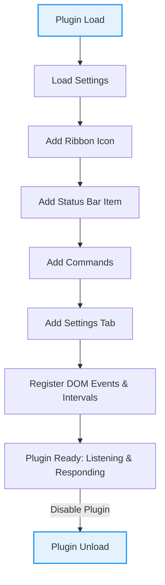

# What is the Obsidian Sample Plugin?

## Unlocking the Power of Obsidian Plugin Development with a Ready-Made Template

The Obsidian Sample Plugin serves as your hands-on learning resource and starting point for developing Obsidian plugins. Designed to demonstrate essential API patterns, testing automation, and construction techniques, it accelerates your journey from plugin concept to implementation.

This plugin is not just a static example; it's a living codebase that you can customize, extend, and build upon. Whether you’re new to Obsidian plugin development or looking to deepen your understanding, this sample plugin gives you both inspiration and a concrete foundation to create powerful custom features within Obsidian.

---

## Why This Plugin Matters to You

- **Learn by Example:** It showcases fundamental API usages like adding ribbon icons, status bar items, commands, modals, settings tabs, and event handling.
- **Build Quickly:** Instead of starting from scratch, use it as a scaffold for your own plugin projects, saving time.
- **Understand API Patterns:** See practical patterns for command registration, state management, settings persistence, and UI integration.
- **Test Integration Ready:** Includes test automation patterns to validate your plugin's behaviors early.

> If you want to transform your ideas into Obsidian plugins confidently and efficiently, this plugin is your essential launchpad.

---

## What Is the Obsidian Sample Plugin?

### A Developer-Focused Template and Learning Resource

At its core, the Sample Plugin is an Obsidian community plugin that demonstrates the platform's plugin API capabilities. It provides an accessible, fully functioning example of how to implement and structure a plugin, so you can inspect real, working code to understand API basics, plugin lifecycle, command creation, UI customization, and settings management.

### Solving Developer Challenges

New plugin developers often struggle with where to begin and how to correctly structure their code using Obsidian's API. The Sample Plugin solves this by providing an authoritative, reference implementation that covers common development tasks and patterns in a clean, concise way.

### What Sets It Apart

Unlike isolated snippets or abstract tutorials, this plugin is complete, maintained, and ready to run in Obsidian. It includes automatic settings handling, modal dialogs, editor commands, global state management, event subscriptions, UI elements, and even interval management — all accompanied by comprehensive documentation.

### How It Works at a High Level

- Registers UI elements such as ribbon icons and status bar items.
- Adds commands that users can trigger globally or within the editor.
- Manages plugin settings with persistence.
- Listens for events like clicks and intervals to showcase lifecycle hooks.

By exploring its source code (`main.ts`) and managing settings, you get hands-on insight into best practices for Obsidian plugin development.

---

## Key Features & Capabilities

### 1. Ribbon Icon with Notifications
Adds an icon on the left ribbon that, when clicked, shows a notice alert. This demonstrates adding interactive UI elements tied to user actions.

### 2. Status Bar Integration
Displays a persistent status bar item at the bottom to showcase unobtrusive status or information feedback.

### 3. Commands
Supports multiple command types:
- Simple commands opening modals.
- Editor commands that perform transformations on selected text.
- Conditional commands that only appear when applicable (e.g., a command available only when a Markdown file is active).

### 4. Modals and UI Interaction
Implements modals (dialog boxes) to show how to engage users with interactive popups for information or input.

### 5. Plugin Settings Tab
Provides a dedicated settings tab where users can customize plugin behavior, with changes saved persistently.

### 6. Event Handling
Registers global DOM event listeners and periodic interval functions that automatically clean up on plugin disable, ensuring stable lifecycle management.


<AccordionGroup title="Example Usage Scenarios">  
<Accordion title="Adding a Ribbon Icon that Shows a Message">  
When a user clicks the dice icon in the ribbon, a notice pops up saying 'This is a notice!'. This immediate visual feedback helps developers see how UI hooks work.
</Accordion>  
<Accordion title="Replacing Selected Text in the Editor">  
Users can trigger the "Sample editor command" to replace whatever text is currently selected with 'Sample Editor Command', illustrating text manipulation within the editor.
</Accordion>  
<Accordion title="Configuring Plugin Settings">  
Users can open the plugin settings tab and adjust a simple text field labeled 'Setting #1'. Changes are saved and loaded between sessions, demonstrating persistent configuration.
</Accordion>  
</AccordionGroup>

---

## Why Should I Care?

### Empower Your Development Process
By working with the Sample Plugin, you: 
- Get a **clear path from zero to functional plugin**.
- Avoid common pitfalls of Obsidian API integration.
- Learn reusable patterns that apply to all plugin types.

### Real-World Use Cases
- **First-time plugin developers** can build confidence by modifying and extending a real plugin.
- **Experienced developers** can rapidly prototype plugin ideas.
- **Educators and workshop leaders** can use this as a teaching tool for Obsidian plugin development.

### Before vs. After
Without this resource, you'd piece together scattered examples, face integration issues, or develop inefficiently. With it, you get:
- A typical plugin bootstrapped
- Working commands and UI features out of the box
- Demonstrated lifecycle and settings management

### Quantifiable Advantages
- Speeds up initial development by removing guesswork.
- Reduces buggy code by showing best practices.
- Provides a tested foundation for future plugin innovations.

---

## Getting Started Preview

### Quick Start
- Clone the repository or use this project as a template
- Install dependencies with `npm i`
- Run `npm run dev` to compile and watch for changes
- Load the plugin in Obsidian and experience the sample commands and UI

### Prerequisites
- Obsidian app version 0.15.0 or higher
- Node.js (v16 or later)

### Next Steps
- Explore the `main.ts` source file to understand how the commands and UI are registered
- Modify the example settings tab to add your own options
- Add custom commands and experiment with the API
- Visit the [Developer Setup Guide](../getting-started/setup-installation/developer-setup) for detailed instructions

---

## Code Snippet: Adding a Ribbon Icon & Command

```typescript
// Adds a dice icon to the ribbon that shows a simple notice when clicked
this.addRibbonIcon('dice', 'Sample Plugin', () => {
  new Notice('This is a notice!');
});

// Adds a command to open a modal dialog on user invocation
this.addCommand({
  id: 'open-sample-modal-simple',
  name: 'Open sample modal (simple)',
  callback: () => {
    new SampleModal(this.app).open();
  }
});
```

This snippet illustrates how to enhance the Obsidian UI and respond to user commands with minimal, clear code.

---

## Troubleshooting Common Issues

<AccordionGroup title="Common Problems and Solutions">
<Accordion title="Plugin Not Showing Up After Installation">
- Ensure the manifest's `minAppVersion` matches your installed Obsidian version or is lower.
- Reload Obsidian and confirm plugin is enabled in the settings.
- Verify your plugin folder structure follows Obsidian's expected format.
</Accordion>
<Accordion title="Commands Not Appearing in Command Palette">
- Check the condition in `checkCallback` if used to ensure the target context (like an active Markdown view) is present.
- Make sure your command ID and names are unique.
</Accordion>
<Accordion title="Settings Not Saving">
- Confirm `loadSettings()` and `saveSettings()` are correctly called.
- Confirm asynchronous calls are awaited properly.
</Accordion>
</AccordionGroup>

---

## Additional Resources

- [Obsidian Plugin API Documentation](https://github.com/obsidianmd/obsidian-api)
- [Obsidian Plugin Developer Guide](https://forum.obsidian.md/c/plugins-dev/)
- [Sample Plugin GitHub Repository](https://github.com/obsidianmd/obsidian-sample-plugin)

Explore these resources after reviewing the sample plugin to deepen your skill and accelerate plugin creation.

---

### Visual Overview: Plugin Lifecycle and Key Components


This flowchart summarizes how the plugin initializes, prepares UI components and commands, and manages cleanup.

---

By mastering this sample plugin, you gain a trusted toolkit and blueprint for making your own Obsidian plugins faster, more reliably, and with confidence.

---

Explore further documentation to extend your learning and bring your plugin ideas to life effectively.


---